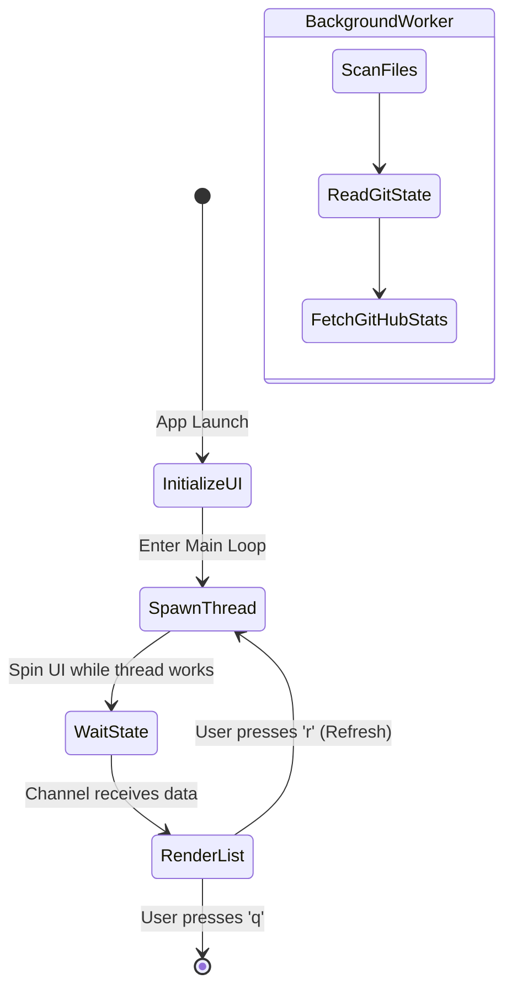

<table border="0">
  <tr>
    <td width="200" align="center" valign="top">
      
    </td>
    <td valign="top">
      <h1>Tropical Project Manager</h1>
      <p><strong>TUI app for manage your local projects.</strong><br/>
      <em>A Rust-based TUI packed with Git and GitHub Integration.</em></p>
      <p>
        <a href="LICENSE"></a>
        
      </p>
    </td>
  </tr>
</table>

---

<!--toc:start-->
- [Tropical Project Manager](#tropical-project-manager)
  - [Overview](#overview)
  - [Using as a CLI Tool](#using-as-a-cli-tool)
  - [Installation](#installation)
  - [Key Features](#key-features)
  - [Technical Architecture](#technical-architecture)
  - [Core Lifecycle](#core-lifecycle)
  - [Command Reference](#command-reference)
<!--toc:end-->

## Overview

**Tropical Project Manager** is a terminal user interface (TUI) designed to act as your central command center for local software projects. 

For command-line users, this project provides a powerful CLI interface.

At its heart lies a powerful background thread engine powered by `std::sync::mpsc`, which scans directories, parses `.git` folders using `git2`, and even reaches out to the GitHub API via `ureq` to pull live repository statistics without ever blocking your terminal's responsiveness.

For end-users, Tropical Project Manager ships with **`tropical-projectmanager`**, a standalone binary.

---

## Using as a CLI Tool

The CLI provides a straightforward interface to interact with Tropical Project Manager.

The CLI can be installed globally or used locally in your project.

```powershell
cargo install --path .
```

**Why use `tropical-projectmanager`?**
* **Instant Overview:** See exactly which projects have pending changes across your entire workspace at a glance.
* **Deep Metrics:** Go beyond "dirty/clean" and see precise counts for added, modified, and deleted files.
* **Stay Synced:** Instantly see if your local branches are ahead or behind their remote counterparts.
* **Standardized Scaffolding:** Create new projects fully compliant with FMG standards in seconds.

---

## Installation

### Via Cargo (Recommended)

Since this is a Rust binary, installing via `cargo` is the most straightforward method.

```powershell
# Clone the repository (if you haven't already)
git clone https://github.com/julesklord/tropical-projectmanager.git
cd tropical-projectmanager

# Install globally via cargo
cargo install --path .

# Run from anywhere!
tropical-projectmanager
```

### GitHub API Rate Limits
To prevent GitHub API rate limits (60 requests/hour), the application automatically detects if you have a `GITHUB_TOKEN` environment variable set and will use it to authenticate requests.

```powershell
$env:GITHUB_TOKEN="your_personal_access_token_here"
tropical-projectmanager
```

---

## Key Features

*   **⚡ Async Non-Blocking Scans**: The UI remains buttery smooth at 60fps. Repositories are scanned, analyzed, and fetched in the background.
*   **🐙 Advanced Git Metrics**: Stop guessing what "dirty" means. See exactly how many files are `+` (Untracked), `~` (Modified), and `-` (Deleted) right in the UI.
*   **⬆️ Ahead / Behind Tracking**: Instantly know if your local branch is out of sync with the remote repository.
*   **🌐 Live GitHub Stats**: Automatically parses your `origin` remote. If it's a GitHub repo, it fetches Stars (★), Forks (🍴), and Open Issues (🐛) using the official GitHub API.
*   **✨ FMG Standard Project Scaffolding**: Press `c` to instantly create a new project. The manager automatically copies the `jules_dev_standard/template` structure and runs `git init` for you.
*   **🖱️ Full Mouse & Keyboard Support**: Navigate like a pro using `j/k`, arrow keys, or just use your mouse wheel and click directly on the project list.

---

## Technical Architecture

The application is strictly separated into an event-driven front-end and an asynchronous back-end worker.


### Core Components

- **`tropical-projectmanager`**: The core binary responsible for rendering the TUI, handling background threads, and coordinating file system interactions.

---

## Core Lifecycle

The application follows a simple but robust lifecycle to ensure the terminal remains responsive while fetching heavy Git and network data.



---

## Command Reference

Once launched, the application searches the parent directory (`..` by default) for any subfolders containing a `.git` directory. You interact with it entirely via TUI controls.

| Action | Control | Description |
| :--- | :--- | :--- |
| **Navigate Down** | `j` or `↓` or Mouse Scroll Down | Select the next project in the list. |
| **Navigate Up** | `k` or `↑` or Mouse Scroll Up | Select the previous project in the list. |
| **Refresh** | `r` | Re-scan the master directory for changes. |
| **Create Project** | `c` | Open prompt to create a new FMG standard project. |
| **Confirm Create** | `Enter` | Confirm project name and execute creation. |
| **Cancel/Quit** | `Esc` or `q` | Quit the application or cancel project creation. |
| **Select Project** | `Left Click` | Click on a project in the list to view its details. |
