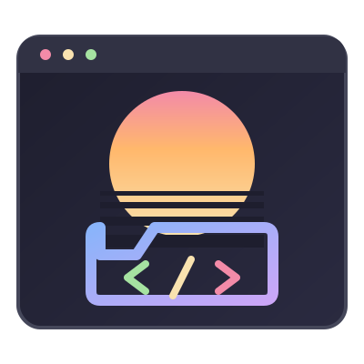
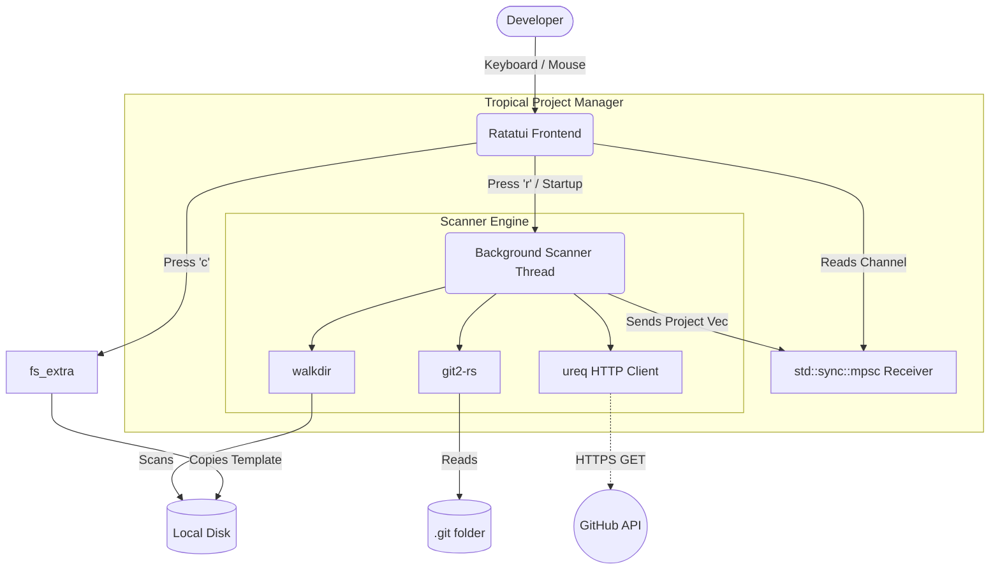

<table border="0">
  <tr>
    <td width="200" align="center" valign="top">
      
    </td>
    <td valign="top">
      <h1>Tropical Project Manager</h1>
      <p><strong>TUI app for manage your local projects.</strong><br/>
      <em>A Rust-based TUI packed with Git and GitHub Integration.</em></p>
      <p>
        <a href="LICENSE"></a>
        
      </p>
    </td>
  </tr>
</table>

---

<!--toc:start-->
- [Tropical Project Manager](#tropical-project-manager)
  - [Overview](#overview)
  - [Key Features](#key-features)
  - [Installation](#installation)
  - [Usage](#usage)
  - [Project Creation Guidelines](#project-creation-guidelines)
  - [Technical Architecture](#technical-architecture)
<!--toc:end-->

## Overview

**Tropical Project Manager** is a terminal user interface (TUI) designed to act as your central command center for local software projects. 

Built with speed and aesthetics in mind using Rust, Ratatui, and Crossterm, it asynchronously scans your master directory for Git repositories and gives you a deep, real-time breakdown of your workspace.

At its heart lies a powerful background thread engine powered by `std::sync::mpsc`, which scans directories, parses `.git` folders using `git2`, and even reaches out to the GitHub API via `ureq` to pull live repository statistics without ever blocking your terminal's responsiveness.

---

## Key Features

*   **⚡ Async Non-Blocking Scans**: The UI remains buttery smooth at 60fps. Repositories are scanned, analyzed, and fetched in the background.
*   **🐙 Advanced Git Metrics**: Stop guessing what "dirty" means. See exactly how many files are `+` (Untracked), `~` (Modified), and `-` (Deleted) right in the UI.
*   **⬆️ Ahead / Behind Tracking**: Instantly know if your local branch is out of sync with the remote repository.
*   **🌐 Live GitHub Stats**: Automatically parses your `origin` remote. If it's a GitHub repo, it fetches Stars (★), Forks (🍴), and Open Issues (🐛) using the official GitHub API.
*   **✨ FMG Standard Project Scaffolding**: Press `c` to instantly create a new project. The manager automatically copies the `jules_dev_standard/template` structure and runs `git init` for you.
*   **🖱️ Full Mouse & Keyboard Support**: Navigate like a pro using `j/k`, arrow keys, or just use your mouse wheel and click directly on the project list.

---

## Installation

### From Source (Recommended)

Since this is a local Rust binary, compiling from source ensures you have the latest performance optimizations for your architecture.

```powershell
# Clone the repository (if you haven't already)
git clone https://github.com/yourusername/tropical-projectmanager.git
cd tropical-projectmanager

# Build and run
cargo run
```

### GitHub API Rate Limits
To prevent GitHub API rate limits (60 requests/hour), the application automatically detects if you have a `GITHUB_TOKEN` environment variable set and will use it to authenticate requests.

```powershell
$env:GITHUB_TOKEN="your_personal_access_token_here"
cargo run
```

---

## Usage

Once launched, the application searches the parent directory (`..` by default) for any subfolders containing a `.git` directory. 

### Keyboard Controls
*   `j` or `↓`: Next project
*   `k` or `↑`: Previous project
*   `r`: Refresh and re-scan directories
*   `c`: Create a new project (Prompts for project name)
*   `Enter`: Confirm project creation
*   `Esc` or `q`: Quit or Cancel project creation

### Mouse Controls
*   **Scroll Wheel:** Navigate the project list up and down.
*   **Left Click:** Directly select a project from the left panel to view its details.

---

## Project Creation Guidelines

Tropical Project Manager enforces the **FMG Repository Development Bible** standard. 

When you press `c` and type a new project name (e.g., `my-new-app`), the application:
1. Creates `../my-new-app`.
2. Copies all the contents from `./jules_dev_standard/template` into the new folder (including standard `.gitignore`, `CHANGELOG.md`, `LICENSE`, `README.md`, etc.).
3. Initializes a fresh `git` repository in the new folder.
4. Rescans the workspace and highlights your new project.

---

## Technical Architecture

The application is strictly separated into an event-driven front-end and an asynchronous back-end worker.


